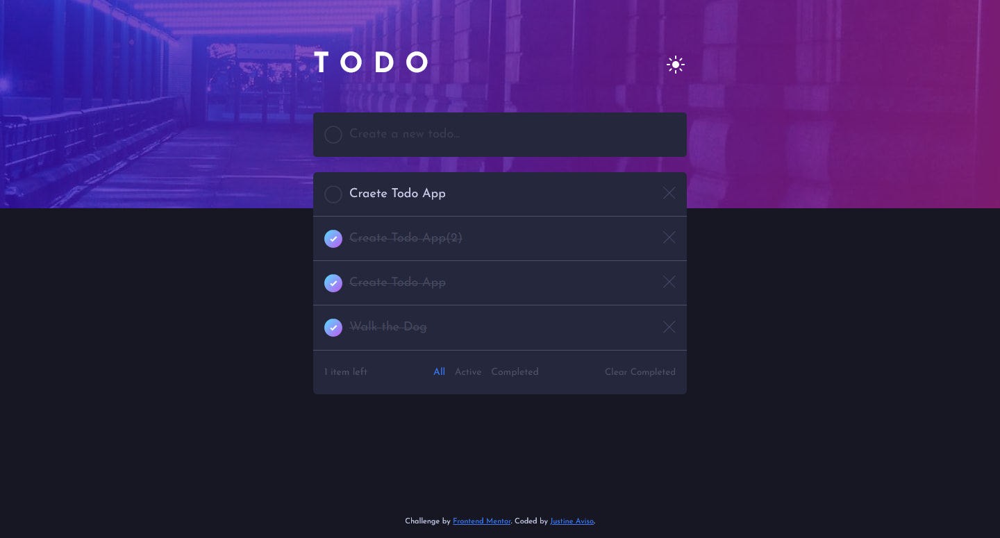
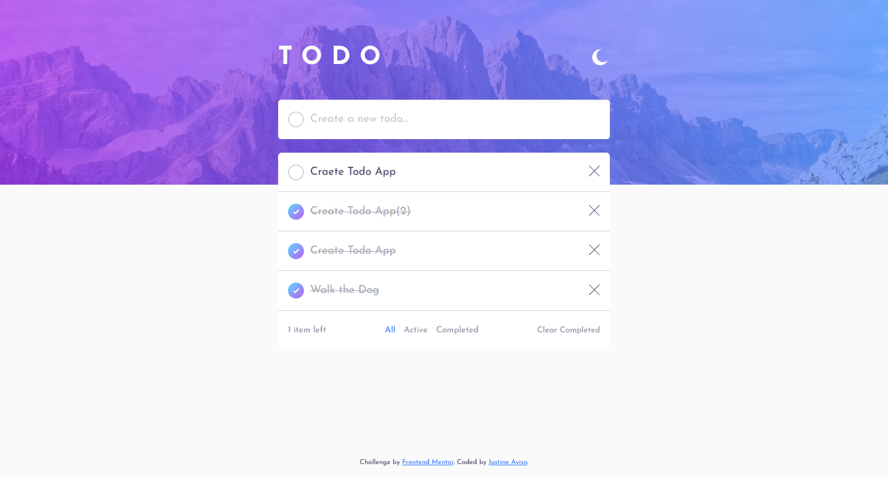
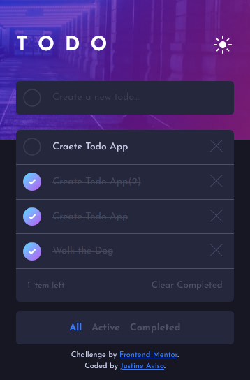
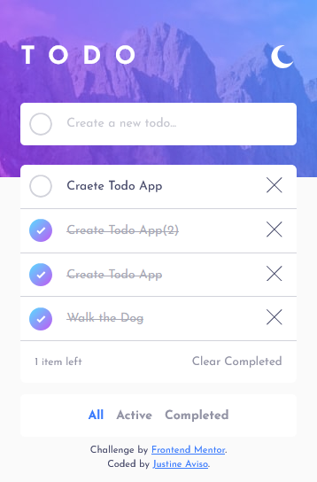

# Frontend Mentor - Todo app solution

This is a solution to the [Todo app challenge on Frontend Mentor](https://www.frontendmentor.io/challenges/todo-app-Su1_KokOW). Frontend Mentor challenges help you improve your coding skills by building realistic projects. 

## Table of contents

- [Overview](#overview)
  - [The challenge](#the-challenge)
  - [Screenshot](#screenshot)
  - [Links](#links)
- [My process](#my-process)
  - [Built with](#built-with)
  - [What I learned](#what-i-learned)
  - [Continued development](#continued-development)
  - [Useful resources](#useful-resources)
- [Author](#author)

**Note: Delete this note and update the table of contents based on what sections you keep.**

## Overview

### The challenge

Users should be able to:

- View the optimal layout for the app depending on their device's screen size
- See hover states for all interactive elements on the page
- Add new todos to the list
- Mark todos as complete
- Delete todos from the list
- Filter by all/active/complete todos
- Clear all completed todos
- Toggle light and dark mode
- **Bonus**: Drag and drop to reorder items on the list

### Screenshot

### Links

- Solution URL: [My Solution](https://www.frontendmentor.io/solutions/todo-app-using-vue3-with-light-and-dark-mode-SNfJl_42Z)
- Live Site URL: [Live Site](https://todo-app-justineaviso.netlify.app/)

## My process 

I've start by reviewing how to add dark and light theme on a website. Then I head into Figma and start defining fontsize, fontweight, width of the container and while im on figma i've also created an outline on what color to use on every element and defines what are their colors in darkmode base on the color pallete given and the design.

After creating an outline on what color to use on each elements on light/dark theme, I started creating css variables on dark-theme first as it contains more color variation than the light theme and I added dark meta tag on root element of the app to start using the colors that i've define. And starts building the ui.

While building the ui, i've encounter a problem where how can I add gradient borders that has radius so I started searching trough the internet. After reading some solutions in the internet, i've come up on with the solution where i will add a 2 background on my checkbox that has different background clip to create a border like effect on my checkbox. But, when I started adding toggle on my dark and light mode, the animation of the checkbox feels weird so I tried other solution where I use webkit mask and I stick with it though it has campatibility issues on IE and Opera Mini

### Built with

- Semantic HTML5 markup
- CSS custom properties
- Flexbox
- Mobile-first workflow
- Dark and Light mode Toggle
- [Vue 3](https://v3.vuejs.org/) - JS Framework

**Note: These are just examples. Delete this note and replace the list above with your own choices**

### What I learned

I've learn that Researching and Planning every step before coding pays a lot. And breaking your UI into smaller components and making it reusable can improve your workflow especially when dealing with a much larger projects.

### Continued development

I'ld like to focus more on precition when implementing design
Become better at using Vue as a whole

### Useful resources

- [Example resource 1](https://mwichary.medium.com/dark-theme-in-a-day-3518dde2955a) - This helps me deal with Light and Dark Mode toggle for this challenge

## Author

- Frontend Mentor - [@eta1389](https://www.frontendmentor.io/profile/eta1389)
